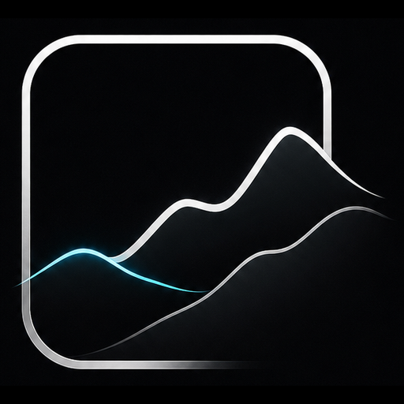

**Terrain and world building for Unreal Engine 5**

## What you'll find here

Plugins written in C++ for building entire worlds.  
Landscape, water and vegetation - all of it editable in Editor and Runtime, and
everything Unreal already gives you keeps working on top.

## [GeoField](https://github.com/VarnyxSystems/GeoField)

GeoField is the first big step in that direction, and the ground the rest will stand on.

Terrain stored as an SDF and editable in Editor and Runtime. Everything reads from
that one field: the geometry you see, the distance fields that light it, the collision,
and every system still to come. Nothing keeps its own copy, so nothing can drift out of
step.

|  |  |
| :-- | :-- |
| **Available** | Runtime sculpting, painting, caves and overhangs, octree level of detail, Nanite rendering, mesh distance fields, collision that follows every edit, byte-stable save and reload, heightmap import |
| **In progress** | Static mesh import, multiple live sources per world, dedicated editor mode, heightmap editor |
| **Planned** | Full PCG support, biome painting inside the heightmap editor, procedural placement of vegetation, rocks and roads, water and rivers, deformable mud and snow, erosion and hydrology, landscape conversion |
